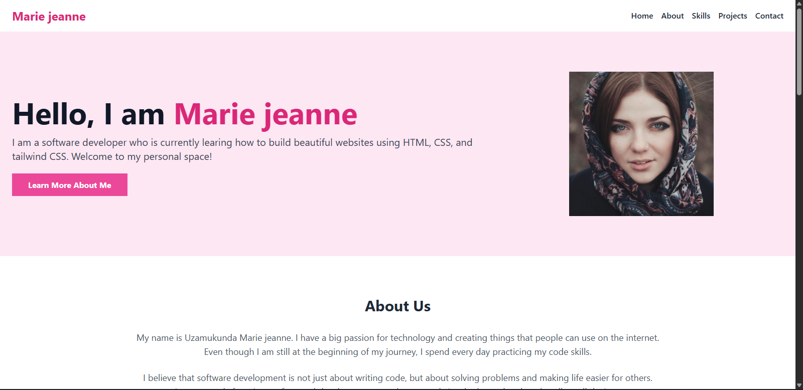
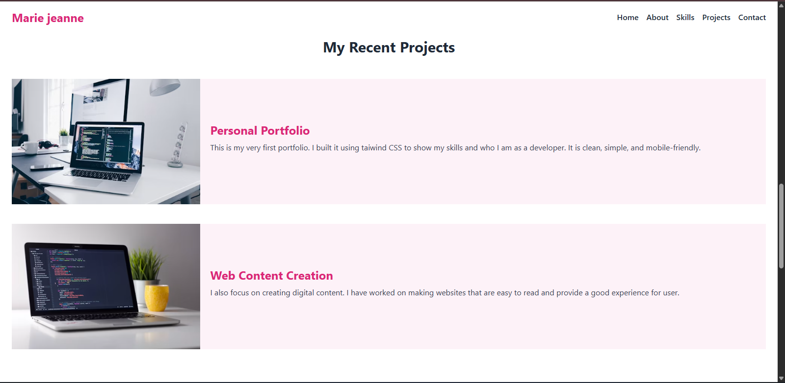

# Uzamukunda Marie jeanne - personal portfolio

A clean, simple single-page portfolio website built to showcase my journey as a software developer. This project was writeen completely from scratch to practice structuring content with html and tailwind css.

## project preview

## Feautures
- **About Me:** A brief introduction to who I am and my passion for code.
- **Learning path:** A breakdown of my skills in html, css, and taiwind css.
- **Projects:** A showcase of my recent work and digital assets.
- **Static contact info:** A simple "get in touch" contact text forms.

## Tech Used
- **HTML:** For page structure and semantic layout.
- **Tailwind css:** For the soft pink background styling and responsive design via direct CDN script link.